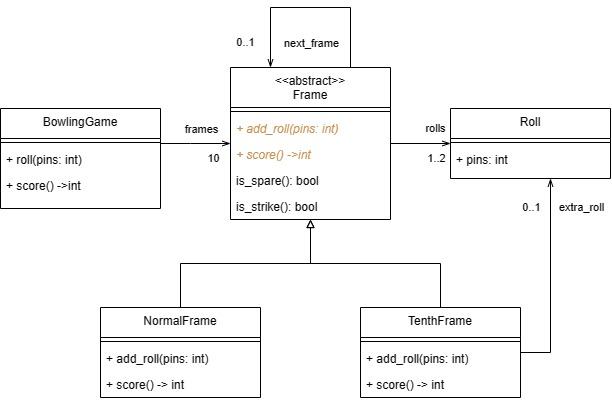

# Implementación de un juego de bolos

En juego consiste en 10 frames (cuadros). Un frame está compuesto de uno o dos tiradas de la bola (rolls) con 10 pines parados en el inicio del frame. Existen tres casos para la tabulación de un frame.

Un frame abierto (open frame) es cuando un puntaje de 10 o menos es obtenido para el frame. En este caso el puntaje del frame es el número de pines tumbados.
Un spare es cuando los 10 pines son tumbados en el segundo lanzamiento. El valor total de un spare es 10 más el número de pines tumbados en el siguiente lanzamiento.
Un strike es cuando los 10 pines son tumbados en el primer lanzamiento. El valor total de un strike es 10 más el número de pines tumbados en los siguientes dos lanzamientos. Si un strike es inmediatamente seguido por un segundo strike, entonces el valor del primer strike no puede ser determinado hasta que la bola sea lanzada una vez más

El frame 10 en un juego es un caso especial. Si se logra un strike o un spare, entonces se obtiene un lanzamiento extra (fill ball). El lanzamiento extra existe para calcular el total del frame 10. Lograr un strike o spare en el lanzamiento extra no le da al jugador más lanzamientos extra. El valor total del frame 10 será el total de pines tumbados.

Por ejemplo:

Para un frame 10 que tenga X 1/ (strike y spare), el valor total será 20.
Para un frame 10 que tenga XXX (tres strikes), el valor total será 30

El modelo del mundo del juego sería el siguiente:

